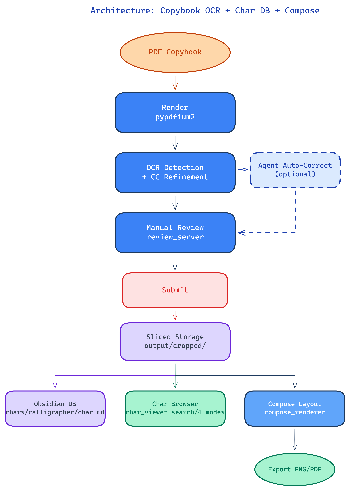
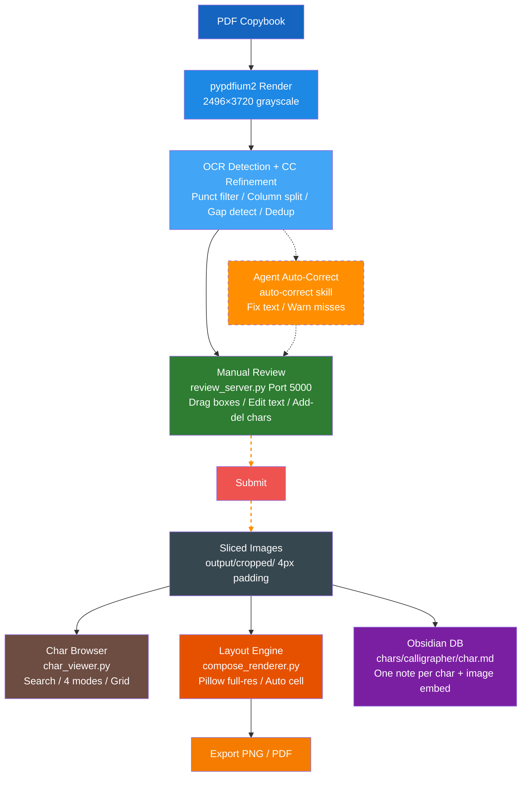

# Calligraphy Practice Assistant — OCR + Character Database + Composition Layout

> English | [中文](README.md)

Extract individual characters from vertical calligraphy copybooks via OCR, manual proofreading, browse & search, and composition layout, building a searchable Obsidian character database.

> **Detailed docs:**
> - [Pipeline Detail](docs/pipeline_detail.en.md) — PDF rendering, character segmentation (OCR + CC refinement), OCR recognition, confidence classification
> - [Web App Detail](docs/gui_detail.en.md) — Review server, char viewer, composition engine, Obsidian export

<div align="center">
  
  <p><em>Copybook → Characters (OCR + CC refinement → Agent auto-correct ╌╌╌ Manual review) → Character DB → Browse / Compose</em></p>
</div>

<details>
<summary>📐 Mermaid source (editable)</summary>



</details>

## Three Web Apps

### 1. Review Server (review_server) — Port 5000

Flask web GUI for drag-based correction of OCR bounding boxes:

<div align="center">
  
  <p><em>Color-coded boxes (red/yellow/blue/cyan), right-side table + paragraph preview, drag handles</em></p>
</div>

- View all detection boxes (color-coded by status)
- Drag handles to adjust box position/size (8 control points)
- Edit recognition text inline (Enter to save)
- Add/delete character boxes, real-time paragraph preview
- Auto-detect and run Pipeline on unprocessed pages
- Skip pages without calligraphy content

**Color coding:**

| Color | Meaning |
|-------|---------|
| Green | Currently selected |
| Blue | Normal |
| Yellow | Shape anomaly (aspect ratio > 2.5) |
| Red | Low confidence (< 80%) or unrecognized |
| Cyan | Manually corrected |

### 2. Char Viewer (char_viewer) — Port 5001

Browse and search all submitted character slices with multi-mode comparison and grid references:

<div align="center">
  
  <p><em>Left sidebar: search by character. Right: 240×240 Fabric.js canvas. Bottom: variant thumbnails</em></p>
</div>

- **Search**: by Chinese character, list all variants (cross-page)
- **Grids**: mizige (米字格) / tianzige (田字格) toggle for structure analysis
- **Four display modes**: original, enhanced (CLAHE + sharpen), bilateral filter, binary
- **Invert**: toggle white-on-black / black-on-white, adaptive background sampling
- **Ink-center align**: auto-detect character centroid, center on canvas
- **Zoom/pan**: scrollwheel zoom, drag to pan, corner resize handle
- **Keyboard shortcuts**: ← prev, → next, R reset, I invert
- **Thumbnail strip**: switch between variants of the same char across pages

### 3. Composition Layout (/compose) — Port 5001

Full-resolution Pillow layout engine that assembles sliced characters into calligraphy compositions:

<div align="center">
  
  <p><em>Left sidebar: variant picker. Bottom params: cols/direction/size/gap/colors. Click preview to locate variant</em></p>
</div>

- **Direction**: vertical RTL/LTR, horizontal LTR/RTL
- **Character rendering**: binary originals pasted at native resolution, never scaled
- **Auto cell size**: `max_char_dim × 1.15`, never overflows
- **Punctuation**: small overlay (45% of cell), bottom-right anchored
- **Backgrounds**: beige/white/black/red + gold fleck (irregular polygons), grass paper (fiber texture)
- **Text colors**: black / white / ink blue / gold / red (5 colors)
- **Variant selection**: search by char in sidebar, switch variants via thumbnails
- **Click-to-locate**: click any character in preview → sidebar auto-scrolls to its variant
- **Zoom**: slider 0.1–5.0×, center-anchored
- **Export**: PNG (client download), PDF (server-side fpdf2, full-resolution embed)

## Module Details

- **[Pipeline Detail](docs/pipeline_detail.en.md)** — Step-by-step: PDF rendering, dual content cropping, OCR char detection, column clustering & sub-column splitting, missing char detection (gap + column-tail), CC refinement, OCR reuse strategy, dedup & post-processing.

- **[Web App Detail](docs/gui_detail.en.md)** — Review server (data model, save/submit flow, page status tracking), char viewer (index building, search, image processing modes), composition engine (auto cell size, background textures, punctuation overlay, PNG/PDF export), Obsidian character database format.

## Project Structure

```
├── pipeline.py              # Pipeline entry point
├── review_server.py         # Flask review GUI (port 5000)
├── char_viewer.py           # Flask char viewer + compose (port 5001)
├── config.py                # Global configuration
├── start_review.bat         # review_server launcher
├── start_char_viewer.bat    # char_viewer launcher
├── AGENTS.md                # Dev log & decisions
├── src/
│   ├── pdf_renderer.py       # PDF rendering
│   ├── page_preprocessor.py  # Page preprocessing
│   ├── char_segmenter.py     # Character segmentation (core)
│   ├── ocr_recognizer.py     # OCR recognition
│   ├── confidence_handler.py # Confidence classification & export
│   └── compose_renderer.py   # Pillow layout engine
├── templates/
│   ├── char_viewer.html      # Fabric.js frontend
│   └── compose.html          # Compose frontend
├── static/
│   └── js/fabric.min.js      # Fabric.js 5.3.0 (local copy)
├── data/
│   └── poems.json            # Poem-to-page mapping
├── docs/
│   ├── images/                # Doc images
│   ├── pipeline_detail.md     # Pipeline docs (zh-CN)
│   ├── pipeline_detail.en.md  # Pipeline docs (en)
│   ├── gui_detail.md          # Web app docs (zh-CN)
│   └── gui_detail.en.md       # Web app docs (en)
└── output/                   # Output (git ignored)
    ├── pages/                # Page renders + OCR JSON
    ├── characters/           # Pipeline sliced chars
    └── cropped/              # GUI submitted chars
```

## Quick Start

### 1. Prerequisites

```bash
git clone <repo-url>
cd handwriting
pip install opencv-python pillow pypdfium2 rapidocr flask fpdf2
```

**Python:** 3.8+. Virtual environment recommended.

### 2. Configuration

Edit `config.py`:

| Parameter | Description | Default |
|-----------|-------------|---------|
| `PDF_PATH` | Path to calligraphy PDF | PDF in project root |
| `CALLIGRAPHER` | Calligrapher name (for dir naming) | `"吴玉生"` |
| `SOURCE_TEXT` | Source text name (for dir naming) | `"红楼梦"` |
| `OBSIDIAN_VAULT` | Obsidian vault root | `D:\notebooks\Lmc\brew` |
| `DPI_SCALE` | PDF render scale | `2` (~200 DPI) |

Set `OBSIDIAN_VAULT` to a temp directory if Obsidian export is not needed.

### 3. Run Pipeline

```bash
# Single page
python pipeline.py 24 --no-correct

# Multiple pages
python pipeline.py 24 27 30 --no-correct
```

Pipeline skips already-processed pages. Results in `output/pages/page_{num}_ocr_results.json`.

### 4. Start Review GUI

```bash
python review_server.py
# → http://127.0.0.1:5000/?p=24
```

- Color-coded boxes (red=low conf, blue=normal, cyan=corrected)
- **Drag handles** to adjust boxes
- **Edit text**: select box → modify in input → Enter to save
- **Add/delete**: toolbar buttons
- **Submit**: crop chars → save to `output/cropped/` → update Obsidian DB → auto-next page

Double-click `start_review.bat` to auto-open browser.

### 5. Browse Character DB

```bash
python char_viewer.py
# → http://127.0.0.1:5001/
```

Search by character in left sidebar. Four display modes, grid overlays, invert, ink-center align. Variant thumbnails at bottom.

### 6. Compose Layout

Switch to "集字排版" tab → enter text → pick variants per char → set parameters → render → export PNG or PDF.

### 7. Common Tasks

| Task | Action |
|------|--------|
| Detect new page | `python pipeline.py N --no-correct` |
| Review results | Start review_server, open page |
| Fix single box | Click → drag or edit text |
| Delete false positive | Select → click "删除" |
| Add missing char | Click "添加" → drag to position → enter text |
| Submit reviewed page | Click "提交" → auto-slice + update DB |
| Browse submitted chars | Start char_viewer → search |
| Create composition | Switch to "集字排版" tab |
| Skip empty page | Click "跳过" |

## Architecture Decisions

### Why crop content before OCR?

Cropping removes page-edge noise, significantly improving OCR stability on vertical text. Testing shows more valid characters and fewer false positives.

### Why OCR instead of pure CV?

Pure CV (projection/connected-components) performs poorly on running-script (行书) with broken strokes (飞白) and ligatures. RapidOCR has built-in character segmentation for more accurate localization, plus confidence scores for filtering.

### Why separate ports for review and char viewer?

Separation of concerns. Review needs complex state management (drag, auto-save, submit). Char viewer focuses on search and display. Each stays simple and cohesive.

### Fabric.js local copy

CDN access is unreliable in China. Fabric.js 5.3.0 is copied to `static/js/fabric.min.js` to avoid page load failures.

### Adaptive background sampling

Char viewer uses histogram peak detection to identify background color, samples ±30 around the peak, auto-adapting to black-on-white or white-on-black copybooks. Background flips with invert.

### Composition engine design

- **No scaling**: binary character images pasted at original resolution, strokes stay crisp
- **Auto cell**: `max_char_dim × 1.15` fits the largest char without overflow
- **Punctuation overlay**: 45% of cell, bottom-right, doesn't affect main char area
- **Background baked-in**: gold fleck and grass rendered natively via Pillow, not CSS

## Key Fix History

| Issue | Symptom | Fix |
|-------|---------|-----|
| Punctuation in refinement | Punctuation CCs mixed into char boxes | Zero out punct regions before CC analysis |
| Downstream char stealing | Adjacent chars share CC components | `claimed_regions` per-char sequential claim |
| Oversize box swallowing noise | Large blank area at column end detected as char | Area > 2×OCR → exclude ROI-boundary-touching components |
| Distant stroke lost | Right na-stroke filtered out (p78) | `overlap_ocr` components always kept |
| Column-tail false positives | 7 false boxes on P210 column tail | Triple guard: search ≤ 2×avg_h, ink-tail skip, overlap >50% skip |
| Char split | 枉 split into two boxes (P24) | Gap merge distance 40→80px |

## Configuration

See `config.py`. Key parameters:

- `CALLIGRAPHER`: Calligrapher name (default: 吴玉生)
- `SOURCE_TEXT`: Source text name (default: 红楼梦)
- `OBSIDIAN_VAULT`: Obsidian vault path
- `DPI_SCALE`: PDF render scale
- `BINARY_THRESHOLD`: Binarization threshold
