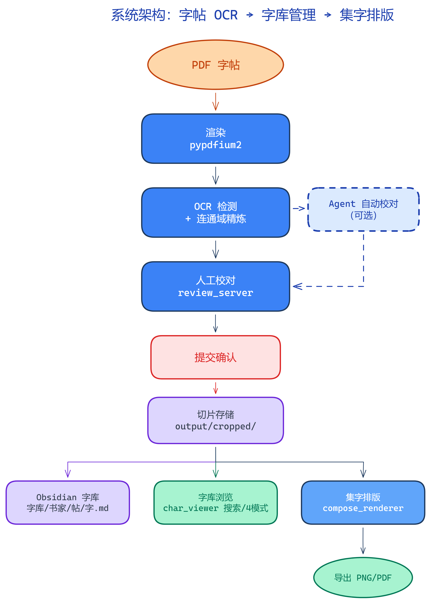
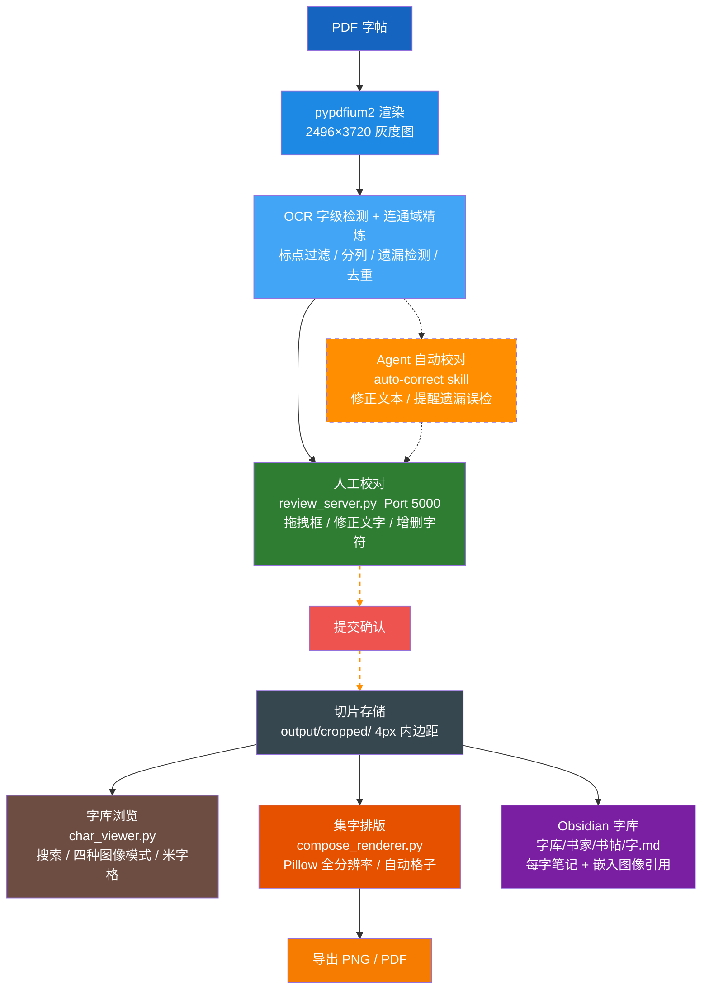
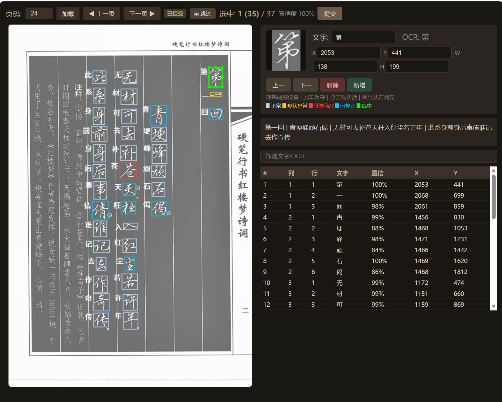
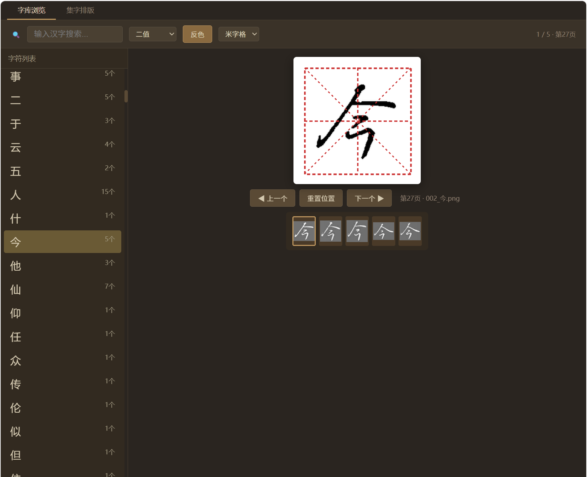
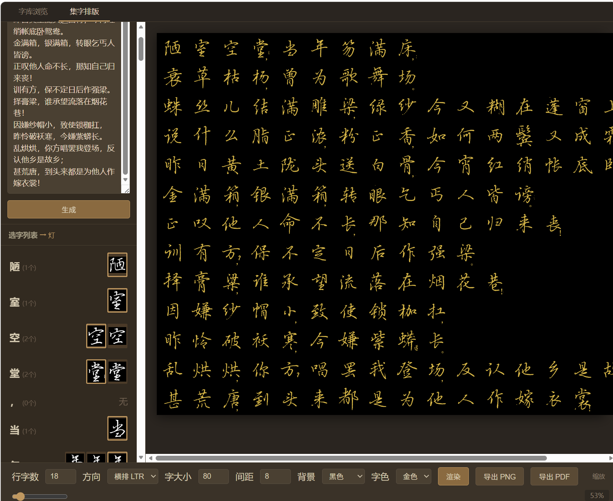

# 书法练习助手 — 字帖 OCR + 字库管理 + 集字排版

> [English](README.en.md) | 中文

将竖排书法字帖逐字切割、OCR 识别、人工校对、浏览检索、集字排版，建立可检索的 Obsidian 字库。覆盖从字帖到可复用的单字资源库全流程。

> **详细文档：**
> - [Pipeline 检测模块详解](docs/pipeline_detail.md) — PDF 渲染、字符切割（OCR + 连通域精炼）、OCR 识别、置信度分类的逐步骤技术说明
> - [Web 应用模块详解](docs/gui_detail.md) — 校对服务器、字符查看器、集字排版引擎、Obsidian 导出的实现逻辑与数据流

<div align="center">
  
  <p><em>字帖 → 单字（OCR + 连通域精炼 → Agent 自动校对 ╌╌╌ 人工校对）→ 单字库 → 浏览 / 排版</em></p>
</div>

<details>
<summary>📐 Mermaid 源码（可编辑 / 重新渲染）</summary>



</details>

## 三大 Web 应用

### 1. 校对服务器 (review_server) — Port 5000

Flask Web 应用，直接在页面上拖拽修正 OCR 检测框：

<div align="center">
  
  <p><em>校对界面：红蓝黄绿彩色框标识状态，右侧表格 + 段落预览，拖拽调整框位置/大小</em></p>
</div>

- 查看所有检测框（颜色编码表示状态）
- 拖拽调整框位置/大小（8 个控制点）
- 手动修正识别文字（回车保存）
- 新增/删除字符框，段落视图实时预览全篇
- 翻页自动检测/调起 Pipeline
- 跳过无书法内容的页面

**颜色编码：**

| 颜色 | 含义 |
|------|------|
| 绿 | 当前选中 |
| 蓝 | 正常 |
| 黄 | 形状异常（宽高比 > 2.5） |
| 红 | 低置信度（< 80%）或未识别 |
| 青 | 已人工修正 |

### 2. 字符查看器 (char_viewer) — Port 5001

提交完成后浏览检索所有已裁剪单字，支持多模式对比和米字格/田字格参考：

<div align="center">
  
  <p><em>字库浏览：左侧搜索栏按字检索，右侧 240×240 Fabric.js 画布显示单字，下方缩略图切换同字变体</em></p>
</div>

- **检索**：按汉字搜索，列出所有变体（跨页面）
- **米字格/田字格**：双模式切换，辅助书法间架结构分析
- **四种处理模式**：原图、清晰增强（CLAHE + 锐化）、双边滤波、二值
- **反色**：一键切换白底黑字/黑底白字，背景色自适应取样
- **墨心居中**：自动计算字符质心，居中对齐
- **缩放/拖拽**：鼠标滚轮缩放，拖拽平移，底角缩放手柄
- **键盘快捷键**：← 上一个、→ 下一个、R 重置、I 反色
- **缩略图条**：同字不同页的变体切换

### 3. 集字排版 (/compose) — Port 5001

Pillow 全分辨率排版引擎，将裁剪的单字拼合成书法作品：

<div align="center">
  
  <p><em>集字排版：侧边栏按字搜索变体，底部参数栏调节行列/方向/间距/配色，预览区点击定位变体</em></p>
</div>

- **方向支持**：竖排 RTL/LTR、横排 LTR/RTL
- **字粒**：二进制原图直接粘贴，不缩放、不模糊
- **自动适配**：格子大小 = max_char_dim × 1.15，保证不溢出
- **标点处理**：小号覆盖层（格子的 45%），右下角定位
- **背景**：米白/白/黑/红 + 洒金宣（不规则多边形）、草木纸（纤维纹理）
- **字色**：黑/白/墨蓝/金/红 5 色
- **变体选择**：侧边栏按字搜索，缩略图切换不同页面同一字的写法
- **点击定位**：预览区点击任意字 → 侧边栏自动滚动到对应变体
- **缩放**：滑块 0.1–5.0 倍，居中缩放
- **导出**：PNG（客户端下载）、PDF（服务端 fpdf2 全分辨率嵌入）

## 模块详解

详细的步骤说明和技术决策见以下文档：

- **[Pipeline 检测模块详解](docs/pipeline_detail.md)** — 逐步骤解释 PDF 渲染、二轮内容裁剪、OCR 字级检测、分列与子列拆分、遗漏字符检测（间隙 + 列尾）、连通域精炼、OCR 识别复用策略、去重后处理。

- **[Web 应用模块详解](docs/gui_detail.md)** — 校对服务器（数据模型、保存/提交流程、页面状态跟踪）、字符查看器（索引构建、搜索、图像处理模式）、集字排版引擎（自动格子、背景纹理、标点覆盖、导出 PNG/PDF）、Obsidian 字库格式。

## 项目结构

```
├── pipeline.py              # 全流程 Pipeline 入口
├── review_server.py         # Flask GUI 校对 (port 5000)
├── char_viewer.py           # Flask 字符查看器 + 集字排版 (port 5001)
├── config.py                # 全局配置
├── start_review.bat         # review_server 启动脚本
├── start_char_viewer.bat    # char_viewer 启动脚本
├── AGENTS.md                # 开发日志与决策记录
├── src/
│   ├── pdf_renderer.py       # PDF 渲染
│   ├── page_preprocessor.py  # 页面预处理
│   ├── char_segmenter.py     # 字符切割（核心：OCR + 连通域精炼）
│   ├── ocr_recognizer.py     # OCR 识别
│   ├── confidence_handler.py # 置信度处理与导出
│   └── compose_renderer.py   # Pillow 排版引擎（集字排版）
├── templates/
│   ├── char_viewer.html      # 字符查看器 Fabric.js 前端
│   └── compose.html          # 集字排版前端
├── static/
│   └── js/fabric.min.js      # Fabric.js 5.3.0（本地 BootCDN 拷贝）
├── data/
│   └── poems.json            # 红楼梦诗词 → 页面映射
├── docs/
│   ├── images/                # 文档配图
│   ├── pipeline_detail.md     # Pipeline 模块详细说明
│   ├── pipeline_detail.en.md  # Pipeline docs (English)
│   ├── gui_detail.md          # Web 应用模块详细说明
│   └── gui_detail.en.md       # Web app docs (English)
└── output/                   # 输出目录（git ignored）
    ├── pages/                # 页面渲染 + OCR 结果 JSON
    ├── characters/           # Pipeline 切割字符图
    └── cropped/              # GUI 提交裁剪字符图
```

## 快速上手指南

以下是从零开始使用本项目的完整流程。

### 1. 环境准备

```bash
# 克隆仓库
git clone <项目地址>
cd handwriting

# 安装依赖
pip install opencv-python pillow pypdfium2 rapidocr flask fpdf2
```

**Python 版本：** 3.8+。建议使用虚拟环境（venv / conda）。

### 2. 配置

编辑 `config.py`：

| 参数 | 说明 | 默认值 |
|------|------|--------|
| `PDF_PATH` | 书法字帖 PDF 文件路径 | 项目根目录下的 PDF |
| `CALLIGRAPHER` | 书家名（用于目录命名） | `"吴玉生"` |
| `SOURCE_TEXT` | 字帖名（用于目录命名） | `"红楼梦"` |
| `OBSIDIAN_VAULT` | Obsidian 仓库根目录 | `D:\notebooks\Lmc\brew` |
| `DPI_SCALE` | PDF 渲染倍率 | `2`（约 200 DPI） |

若不需要 Obsidian 导出，将 `OBSIDIAN_VAULT` 设为临时目录即可。不同字帖切换时只需修改 `CALLIGRAPHER` 和 `SOURCE_TEXT`，数据自动隔离。

### 3. 运行 Pipeline（字符检测）

```bash
# 检测第 24 页
python pipeline.py 24 --no-correct

# 检测多页
python pipeline.py 24 27 30 --no-correct
```

Pipeline 自动跳过已有结果的页面。检测结果保存到 `output/pages/page_{num}_ocr_results.json`。

### 4. 启动校对 GUI

```bash
python review_server.py
# → http://127.0.0.1:5000/?p=24
```

- 页面上所有检测框以颜色编码显示状态（红=低置信度、蓝=正常、青=已修正）。
- **拖拽控制点**调整框位置/大小。
- **修改文字**：选中框 → 输入框中修改 → Enter 保存。
- **新增/删除**：工具栏按钮。
- **提交**：点击"提交" → 裁剪字符 → 保存到 `output/cropped/` → 更新 Obsidian 字库 → 自动下一页。

双击 `start_review.bat` 自动打开浏览器。

### 5. 浏览字库

```bash
python char_viewer.py
# → http://127.0.0.1:5001/
```

左侧搜索按字检索，四种图像模式（原图/增强/双边滤波/二值）、米字格/田字格、反色、墨心居中。下方缩略图切换同字变体。

### 6. 集字排版

在字符查看器中切换到"集字排版"标签 → 输入文字 → 侧边栏为每字选择变体 → 设置参数 → 渲染 → 导出 PNG 或 PDF。

### 7. 常见操作场景

| 场景 | 操作 |
|------|------|
| 检测新页面 | `python pipeline.py N --no-correct` |
| 校对检测结果 | 启动 review_server，打开该页 |
| 修正单个框 | 点击选中 → 拖拽调整或改文字 |
| 删除误检框 | 选中 → 点"删除" |
| 添加遗漏字 | 点"添加" → 拖拽到正确位置 → 填入文字 |
| 提交已完成页 | 点"提交" → 自动切片 + 更新字库 |
| 浏览已提交字符 | 启动 char_viewer → 搜索 |
| 拼合书法作品 | 切换到"集字排版"标签 |
| 跳过无内容页 | 点"跳过"按钮 |

## 架构决策

### 为什么用内容裁剪后跑 OCR？

裁剪后排除页面边缘噪声，OCR 在竖排上的检测稳定性显著提升，实验证明有效字符多、误检少。

### 为什么用 OCR 检测而非纯图像方法？

纯 CV（投影/连通域）对行书飞白、连笔效果差。RapidOCR 内置字符分割模型，定位更准，且输出置信度可用于筛选。

### 字符查看器为何独立端口？

校对（review_server）和浏览（char_viewer）职责分离。校对需要复杂的状态管理（框拖拽、自动保存、提交），浏览专注检索和效果对比。各自保持简单内聚。

### Fabric.js 本地化

由于国内 CDN 访问不稳，将 Fabric.js 5.3.0 拷贝至 `static/js/fabric.min.js`，避免页面加载失败。

### 背景色自适应取样

字符查看器使用直方图峰值检测：统计图像亮度分布，找到峰值（背景色），在该值 ±30 范围内采样平均。自动适配黑底白字/白底黑字两种字帖类型。反色时背景色也随之翻转。

### 集字排版引擎设计

- **无缩放宽高**：二进制字图以原始分辨率粘贴，绝不缩放，保证笔画清晰
- **自动格子**：`max_char_dim × 1.15` 适配最大字，永不溢出
- **标点覆盖层**：占格子 45%，右下角定位，不影响主字区域
- **背景 baked in**：洒金宣、草木纸等纹理以 Pillow 原生绘制，非 CSS 模拟

## 关键修复历史

| 问题 | 表现 | 修复 |
|------|------|------|
| 标点干扰精炼 | 标点连通分量混入正文字框 | 标点区域置 0 排除 |
| 后字窃取前字分量 | 上下字共享连通分量 | claimed_regions 逐字声明 |
| 过大框吞并噪声 | 列末尾大片空白判为一个字 | 面积 > 2×OCR 框时排除接触 ROI 边界的组件 |
| 远距离笔画丢失 | 右捺笔被过滤（光，第78页） | overlap_ocr 组件始终保留 |
| 列尾误检 | P210 列尾 7 个假阳性 | 三阶段修复：搜索范围 ≤2×avg_height、ink-tail 跳过、重叠 >50% 跳过 |
| 字符分裂 | 枉 字上下框分离（P24） | 间隙组件合并距离 40→80px |

## 配置参数

见 `config.py`，主要参数：

- `CALLIGRAPHER`：书家名（默认 吴玉生）
- `SOURCE_TEXT`：字帖名（默认 红楼梦）
- `OBSIDIAN_VAULT`：Obsidian 仓库路径
- `DPI_SCALE`：PDF 渲染倍率
- `BINARY_THRESHOLD`：二值化阈值
