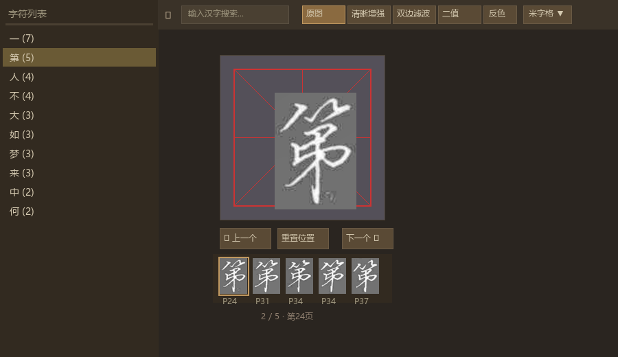
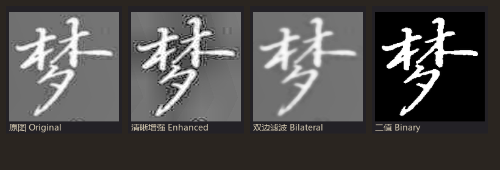
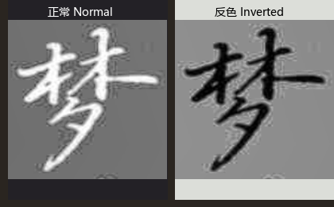
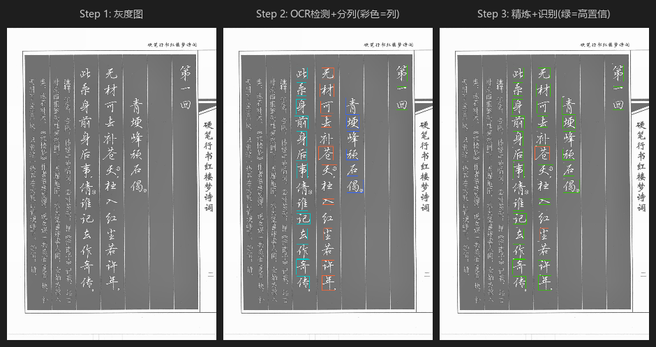
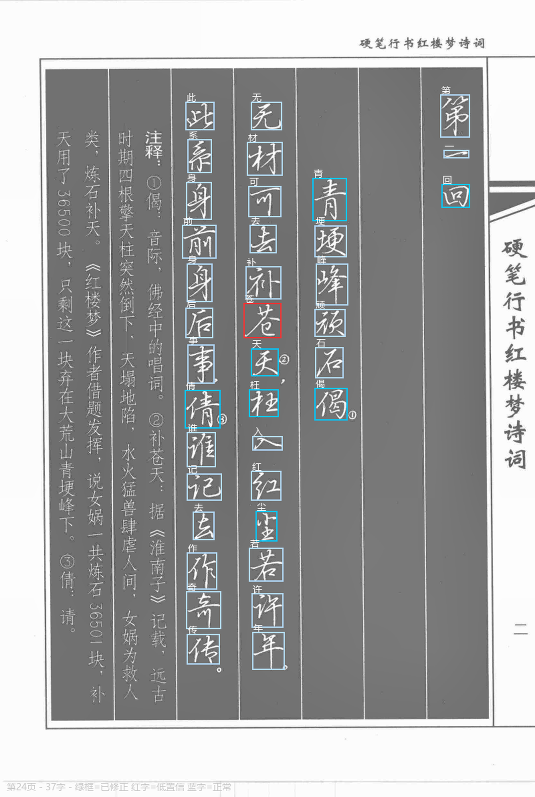

# 字帖校对系统 — 红楼梦 吴玉生硬笔行书

将竖排书法字帖逐字切割、OCR 识别、人工校对、浏览检索，最终建立可检索的 Obsidian 字库。

<div align="center">
  
  <p><em>总体架构：Pipeline 检测 → GUI 校对 → 切片存储 + Obsidian 字库 → 字符查看器</em></p>
</div>

## 两大 Web 应用

### 1. 校对服务器 (review_server) — Port 5000

Flask Web 应用，直接在页面上拖拽修正 OCR 检测框：

- 查看所有检测框（颜色编码表示状态）
- 拖拽调整框位置/大小（8 个控制点）
- 手动修正识别文字（回车保存）
- 新增/删除字符框，段落视图实时预览全篇
- 翻页自动检测/调起 Pipeline
- 跳过无书法内容的页面

**颜色编码：**

| 颜色 | 含义 |
|------|------|
| 绿 | 当前选中 |
| 蓝 | 正常 |
| 黄 | 形状异常（宽高比 > 2.5） |
| 红 | 低置信度（< 80%）或未识别 |
| 青 | 已人工修正 |

### 2. 字符查看器 (char_viewer) — Port 5001

提交完成后浏览检索所有已裁剪单字，支持多模式对比和米字格/田字格参考：

<div align="center">
  
  <p><em>字符查看器：左侧检索栏、米字格居中显示、下方缩略图切换同字不同页</em></p>
</div>

- **检索**：按汉字搜索，列出所有变体（跨页面）
- **米字格/田字格**：双模式切换，辅助书法间架结构分析
- **四种处理模式**：原图、清晰增强（CLAHE + 锐化）、双边滤波、二值
- **反色**：一键切换白底黑字/黑底白字，背景色自适应取样
- **墨心居中**：自动计算字符质心，居中对齐
- **缩放/拖拽**：鼠标滚轮缩放，拖拽平移，底角缩放手柄
- **键盘快捷键**：← 上一个、→ 下一个、R 重置、I 反色
- **缩略图条**：同字不同页的变体切换

<div align="center">
  
  <p><em>同一字符在 4 种处理模式下的渲染效果</em></p>
</div>

<div align="center">
  
  <p><em>原图与反色效果，背景色自动匹配图像主体</em></p>
</div>

## 流程

### Step 1: 检测 Pipeline

<div align="center">
  
  <p><em>Pipeline 处理流程：从灰度图 → OCR 检测 → 精炼识别</em></p>
</div>

关键步骤：

1. **渲染**：PDF → 灰度图（2496×3720 A4 等比例）
2. **内容裁剪**：滑动窗口检测暗像素密度，排除边缘空白
3. **OCR 单字检测**：RapidOCR `return_word_box=True` 获取字级边界框
4. **标点过滤**：排除标点符号和空白框，记录区域供精炼阶段排除
5. **分列**：按 X 中心坐标聚类，拆分子列，合并行内小字到主列
6. **遗漏字符检测**：间隙 + 列尾检测 OCR 漏检的飞白/淡墨
7. **连通域精炼**：以 OCR 框为中心，连通域分析精确裁剪字符边界
8. **OCR 识别**：优先使用原始 OCR 原文，仅原文为空时重新识别
9. **去重**：IoU > 0.3 的保留较大框
10. **后处理**：按列检测异常大框（中位面积 3×以上），缩小至合理尺寸

### Step 2: GUI 人工校对

<div align="center">
  
  <p><em>Flask Web 校对界面</em></p>
</div>

### Step 3: 提交 → 切片存储 + Obsidian 字库

<div align="center">
  
  <p><em>提交后按阅读顺序命名的单字切片</em></p>
</div>

点击「提交」后自动完成：

- **切片存储**：`output/cropped/{书家}/{字帖}/page_{页码}/{序号}_{字}.png`
  - 阅读顺序编号（右→左，上→下），每字外扩 4px 边距
- **Obsidian 字库**：`字库/{书家}/{字帖}/{字}.md`
  - frontmatter：char, calligrapher, source
  - 正文：表格嵌入该字所有出现的图片 + 置信度 + 上下文
  - 同字累加，不同页面、同页多次出现均合并到同一文件

## 项目结构

```
├── pipeline.py              # 全流程 Pipeline 入口
├── review_server.py         # Flask GUI 校对 (port 5000)
├── char_viewer.py           # Flask 字符查看器 (port 5001)
├── config.py                # 全局配置
├── start_gui.bat            # review_server 启动脚本
├── start_char_viewer.bat    # char_viewer 启动脚本
├── AGENTS.md                # 开发日志与决策记录
├── src/
│   ├── pdf_renderer.py       # PDF 渲染
│   ├── page_preprocessor.py  # 页面预处理
│   ├── char_segmenter.py     # 字符切割（核心：OCR + 连通域精炼）
│   ├── ocr_recognizer.py     # OCR 识别
│   ├── confidence_handler.py # 置信度处理与导出
│   ├── corrector.py          # 诗词自动校对（基于 LCS）
│   └── obsidian_export.py    # Obsidian 导出（旧版）
├── templates/
│   └── char_viewer.html      # 字符查看器 Fabric.js 前端
├── static/
│   └── js/fabric.min.js      # Fabric.js 5.3.0（本地 BootCDN 拷贝）
├── data/
│   └── poems.json            # 红楼梦诗词 → 页面映射
├── docs/
│   └── images/               # 文档配图
└── output/                   # 输出目录（git ignored）
    ├── pages/                # 页面渲染 + OCR 结果 JSON
    ├── characters/           # Pipeline 切割字符图
    └── cropped/              # GUI 提交裁剪字符图
```

## 启动

```bash
# 校对 GUI
python review_server.py
# → http://127.0.0.1:5000/?p=24

# 字符查看器
python char_viewer.py
# → http://127.0.0.1:5001/
```

或双击 `start_gui.bat` / `start_char_viewer.bat`。

## Pipeline CLI

```bash
# 单页运行（不自动校对）
python pipeline.py 24 --no-correct

# 批量运行 7 页
python run_all_7.py
```

## 架构决策

### 为什么用内容裁剪后跑 OCR？

裁剪后排除页面边缘噪声，OCR 在竖排上的检测稳定性显著提升，实验证明有效字符多、误检少。

### 为什么用 OCR 检测而非纯图像方法？

纯 CV（投影/连通域）对行书飞白、连笔效果差。RapidOCR 内置字符分割模型，定位更准，且输出置信度可用于筛选。

### 字符查看器为何独立端口？

校对（review_server）和浏览（char_viewer）职责分离。校对需要复杂的状态管理（框拖拽、自动保存、提交），浏览专注检索和效果对比。各自保持简单内聚。

### Fabric.js 本地化

由于国内 CDN 访问不稳，将 Fabric.js 5.3.0 拷贝至 `static/js/fabric.min.js`，避免页面加载失败。

### 背景色自适应取样

字符查看器使用直方图峰值检测：统计图像亮度分布，找到峰值（背景色），在该值 ±30 范围内采样平均。自动适配黑底白字/白底黑字两种字帖类型。反色时背景色也随之翻转。

## 关键修复历史

| 问题 | 表现 | 修复 |
|------|------|------|
| 标点干扰精炼 | 标点连通分量混入正文字框 | 标点区域置 0 排除 |
| 后字窃取前字分量 | 上下字共享连通分量 | claimed_regions 逐字声明 |
| 过大框吞并噪声 | 列末尾大片空白判为一个字 | 面积 > 2×OCR 框时排除接触 ROI 边界的组件 |
| 远距离笔画丢失 | 右捺笔被过滤（光，第78页） | overlap_ocr 组件始终保留 |
| 列尾误检 | P210 列尾 7 个假阳性 | 三阶段修复：搜索范围 ≤2×avg_height、ink-tail 跳过、重叠 >50% 跳过 |
| 字符分裂 | 枉 字上下框分离（P24） | 间隙组件合并距离 40→80px |

## 配置参数

见 `config.py`，主要参数：

- `CALLIGRAPHER`：书家名（默认 吴玉生）
- `SOURCE_TEXT`：字帖名（默认 红楼梦）
- `OBSIDIAN_VAULT`：Obsidian 仓库路径
- `DPI_SCALE`：PDF 渲染倍率
- `BINARY_THRESHOLD`：二值化阈值
