# 字帖校对系统 — 红楼梦 吴玉生硬笔行书

将竖排书法字帖逐字切割、OCR 识别、人工校对，最终建立可检索的 Obsidian 字库。

## 背景

吴玉生硬笔行书《红楼梦诗词》PDF 共 260 页，每页为竖排手写行书。需要从中精确提取每个单字，建立字帖字库供临摹学习。

### 核心挑战

- **竖排文本**：标准 OCR（RapidOCR）面向横排文字，对竖排检测不稳定
- **行书笔画**：飞白（枯笔）、连笔导致 OCR 漏检或分裂
- **排版复杂**：正文旁有小字注释，需区分
- **标点干扰**：句读圆圈、逗号等与正文笔画粘连

## 流程

### Step 1: 检测 Pipeline

```mermaid
flowchart LR
  PDF -->|渲染| Grayscale
  Grayscale -->|内容裁剪| MainArea
  MainArea -->|RapidOCR| OCRBoxes
  OCRBoxes -->|过滤标点| CleanBoxes
  CleanBoxes -->|分列聚类| Columns
  Columns -->|遗漏检测| MissingChars
  MissingChars -->|连通域精炼| RefinedBoxes
  RefinedBoxes -->|OCR识别| Recognized
  Recognized -->|去重+后处理| Final
```



关键步骤：

1. **渲染**：PDF → 灰度图（2496×3720 A4 等比例）
2. **内容裁剪**：滑动窗口检测暗像素密度，排除边缘空白
3. **OCR 单字检测**：RapidOCR `return_word_box=True` 获取字级边界框
4. **标点过滤**：排除标点符号和空白框，记录区域供精炼阶段排除
5. **分列**：按 X 中心坐标聚类，拆分子列（大字/小字分离），合并行内小字到主列，按列宽过滤书法列
6. **遗漏字符检测**：间隙 + 列尾检测 OCR 漏检的字符（飞白/淡墨）
7. **连通域精炼**：以 OCR 框为中心，连通域分析精确裁剪字符像素级边界
8. **OCR 识别**：优先使用原始 OCR 原文，仅原文为空时重新识别
9. **去重**：IoU > 0.3 的保留较大框
10. **后处理**：按列检测异常大框（中位面积 3×以上），缩小至合理尺寸

### Step 2: GUI 人工校对

Flask Web 应用，直接在页面上：

- 查看所有检测框（颜色编码表示状态）
- 拖拽调整框位置/大小（8 个控制点）
- 手动修正识别文字（回车保存）
- 新增/删除字符框
- 段落视图实时预览全文
- 翻页自动检测/调起 Pipeline
- 跳过无书法内容的页面

颜色编码：

| 颜色 | 含义 |
|------|------|
| 绿 | 当前选中 |
| 蓝 | 正常 |
| 黄 | 形状异常（宽高比 > 2.5） |
| 红 | 低置信度（< 80%）或未识别 |
| 青 | 已人工修正 |

### Step 3: 提交 → 切片存储 + Obsidian 字库

点击「提交」后自动完成：

- **切片存储**：`output/cropped/{书家}/{字帖}/page_{页码}/{序号}_{字}.png`
  - 阅读顺序编号（右→左，上→下），每字外扩 4px 边距
- **Obsidian 字库**：`字库/{书家}/{字帖}/{字}.md`
  - frontmatter：char, calligrapher, source
  - 正文：表格嵌入该字所有出现的图片 + 置信度 + 上下文
  - 同字累加，不同页面、同页多次出现均合并到同一文件

## 项目结构

```
├── pipeline.py           # 全流程 Pipeline 入口
├── review_server.py      # Flask GUI 校对服务器
├── config.py             # 全局配置（PDF 路径、书家、字库路径等）
├── start_gui.bat         # Windows 启动脚本
├── AGENTS.md             # 开发日志与决策记录
├── src/
│   ├── pdf_renderer.py       # PDF 渲染
│   ├── page_preprocessor.py  # 页面预处理
│   ├── char_segmenter.py     # 字符切割（核心：OCR + 连通域精炼）
│   ├── ocr_recognizer.py     # OCR 识别
│   ├── confidence_handler.py # 置信度处理与导出
│   ├── corrector.py          # 诗词自动校对（基于 LCS）
│   └── obsidian_export.py    # Obsidian 导出（旧版，新流程由 GUI 提交完成）
├── data/
│   └── poems.json            # 23 首红楼梦诗词 → 页面映射
└── output/
    ├── pages/                 # 页面渲染 + OCR 结果 JSON
    ├── characters/            # Pipeline 切割字符图
    └── cropped/               # GUI 提交裁剪字符图
```

## 启动

```bash
python review_server.py
# → http://127.0.0.1:5000/?p=24
```

或双击 `start_gui.bat`。

## 关键决策与历史教训

### 为什么用内容裁剪后跑 OCR，而非原图直接跑？

- 裁剪后排除页面边缘噪声，OCR 在竖排上的检测稳定性显著提升
- 实验证明裁剪后有效字符多、误检少

### 为什么用 OCR 检测而非纯图像方法？

- 纯 CV（投影/连通域）对行书飞白、连笔效果差
- RapidOCR 内置字符分割模型，定位更准，且输出置信度可用于筛选

### 连通域精炼的几个关键修复

| 问题 | 表现 | 修复 |
|------|------|------|
| 标点干扰精炼 | 标点连通分量混入正文字框 | 标点区域置 0 排除 |
| 后字窃取前字分量 | 上下字共享连通分量 | claimed_regions 逐字声明 |
| 过大框吞并噪声 | 列末尾大片空白+噪点判为一个字 | 面积 > 2×OCR 框时排除接触 ROI 边界的组件 |
| 远距离笔画丢失 | 右捺笔被过滤（光，第78页） | overlap_ocr 组件始终保留 |

### 列尾误检的教训

三阶段修复：限制搜索范围（≤2×avg_height）→ 跳过 ink-tail（距上方字符 <25% avg_height）→ 跳过重叠 >50%

P210 列尾假阳性从 7 个降为 0。

### 关系字段的选择

用 `orig_idx` 追踪每个字符在原始 OCR 结果中的位置，而非依赖 `bx` 数组索引。这样在新增/删除操作后，校正记录不会错位。

## 配置参数

见 `config.py`，主要参数：

- `CALLIGRAPHER`：书家名（默认 吴玉生）
- `SOURCE_TEXT`：字帖名（默认 红楼梦）
- `OBSIDIAN_VAULT`：Obsidian 仓库路径
- `DPI_SCALE`：PDF 渲染倍率
- `BINARY_THRESHOLD`：二值化阈值
